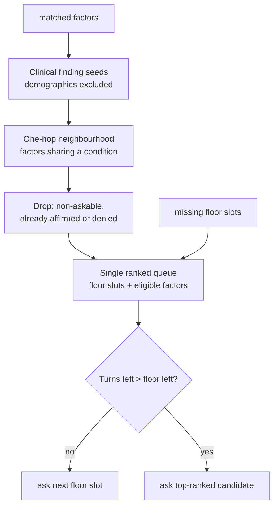

# Phase 3 — Relevance ranker and relaxed slot order

**Status:** not started · **Prerequisite:** [Phase 1](01_factor_state_and_denials.md) and [Phase 2](02_graph_v3_and_factor_asks.md) merged · **Unblocks:** [Phase 4](04_escalation_arm3_and_eval.md)
**Parent design:** [graph_driven_intake.md](graph_driven_intake.md)

---

## What changes here

This is the behaviour change. Everything before it was substrate.

The fixed question sequence in `intake_slots.py` — age → sex → symptom_anchor → quality → severity → duration → provocative → palliative → comorbidities — is replaced by a **single queue containing both floor slots and eligible graph factors, re-ranked every turn**.

There is no second coverage layer and no interrupt. The queue **reorders**; it does not enumerate. There is no "graph coverage complete" state, and no goal of covering the graph.



---

## 1. Eligibility: one hop from a clinical finding

A factor `G` is a candidate this turn only if **all** hold:

- `G` shares a condition with at least one currently matched factor. Phase 2 already folded `CONFIRM_AGAINST` into `factors_by_condition`, so the tingling → CES hop needs no special case here.
- `G` is askable (`askable=yes` on the v4 factors CSV, loaded in Phase 2). Non-askable mediators are not candidates; walk to the askable sources that feed them.
- `factor_states[G] == "unknown"` (Phase 1 store).

**Seeds are clinical findings only.** `Age over 50`, `Male sex`, and `Female sex` are excluded as neighbourhood seeds. `Age over 50` alone belongs to all six non-mechanical conditions (`r_1`, `r_20`, `r_34`, `r_50`, `r_65`), so seeding from demographics makes one hop cover essentially the whole graph. They still count as matched factors for disposition; they just do not open new question territory.

No relevance threshold, no completion goal. When the neighbourhood is exhausted or the budget runs out, disposition proceeds.

High-acuity set = **CES, AAA, DVT, Infection, Fracture, Malignancy** — every condition except **Non-specific Mechanical Cause**.

## 2. Ranking tiers

Default order, tunable (see user action below — this is a clinical judgement call, not a derivation):

- **Tier 0:** `symptom_anchor` if missing
- **Tier 1:** time-critical factors (CES, AAA, DVT)
- **Tier 2:** `age`, `sex`, `comorbidities`
- **Tier 3:** other high-acuity factors (Fracture, Malignancy, Infection)
- **Tier 4:** remaining symptom slots
- **Tier 5:** Non-specific Mechanical Cause factors

Within a tier, tie-break by: `is_specific` yes before no → factor sits on ≥2 currently touched conditions → count of matched factors already on that condition → ontology order.

**Why `comorbidities` is Tier 2 and not last.** Unlike `age` and `sex`, the comorbidity answer is itself a rich source of graph seeds — `Diabetes`, `Osteoporosis`, `Previous cancer`, `Immunosuppression`, `Rheumatoid arthritis`, `Hypertension`, `Cardiovascular disease`, `Previous DVT` — and each touches only one to three conditions rather than all six. It opens discriminating neighbourhood rather than flooding it. This is the exact inverse of the demographic-seed exclusion: demographics are excluded because they touch everything; comorbidities are promoted because they do not.

This requires removing a precondition: `select_next_missing_slot` currently returns `comorbidities` only once no symptom gaps remain (`intake_slots.py:120-127`).

## 3. Relaxing the fixed slot order

`_first_missing_for_symptom` (`intake_slots.py:76`) walks `_SYMPTOM_SLOT_ORDER` as a hard sequence. That order is arbitrary with respect to what the graph needs. Replace it with prerequisites plus relevance.

**The only ordering that survives:**

- `symptom_anchor` precedes every symptom-attribute slot. Nothing else is a real dependency.
- Per-symptom binding stays: with multiple symptom instances, a slot is still asked against a specific `symptom_id`.

**Slot relevance = how much graph the answer opens**, which is statically known from `_KIND_LABEL_FACTORS` and `_TEXT_ALIASES` in `factor_patterns.py`:

- `comorbidities` — highest yield (see Tier 2 above).
- `symptom_quality` — `Night pain`, `Unexplained weight loss` (Malignancy and Infection), plus `Constant pain` / `Fluctuating pain` by alias.
- `symptom_severity` — `Severe pain` via `_severity_implies_severe`, touching Fracture, Malignancy, Infection.
- `provocative` — `Pain weight-bearing` (Fracture), plus mechanical aliases.
- `palliative` — mechanical aliases only, plus the `("palliative", "rest") → Constant pain` mapping that `_gap_for_match` already flags as clinically inverted.
- `symptom_duration` — **no deterministic factor at all.** No duration factor exists in the inventory; only the optional LLM cross-check could reach `Refractory pain`.

So the default order inside Tier 4 becomes quality, severity, provocative, palliative, **duration last**. Duration remains mandatory for the floor and for the disposition summary; it is simply never the most informative next question. **Ranking last is not the same as optional.**

## 4. Coherence guard

Pure per-turn re-ranking produces an incoherent interview: severity, then saddle, then duration, then calf pain, then quality. Two rules:

- **Same-topic continuation.** A candidate bound to the same `symptom_id` and topic as the previous turn gets a bonus, so a line of questioning finishes before the queue moves on.
- **Hysteresis.** Do not switch topic unless the new candidate outranks the incumbent by a full tier. Tier 1 time-critical factors ignore this and always pre-empt.

## 5. Floor protection and budget

The floor stays a hard requirement for `ready_for_disposition`. To stop factor questions starving it:

```
remaining_floor = count(missing floor slots)
if (max_questions - questions_asked) <= remaining_floor:
    ask floor slots only
```

Raise `max_questions` to **20**. With a floor of roughly nine, that leaves about eleven discretionary turns. Single shared budget — no separate graph-question budget.

If the budget is exhausted while a time-critical CES / AAA / DVT factor is still unknown: **"not enough to advise"**, not a mechanical self-care dump.

## 6. Insertion point — the easy thing to get wrong

`plan_next_question` (`bot/app/orchestrator/question_planner.py`) returns early, in this order, before `select_next_missing_slot` is ever reached (lines 43–52):

```
44:    if risk_hits: ...
46:    if questions_asked >= settings.max_questions: ...
51:    if coverage.get("ready_for_disposition"): ...
54:    slot, active_id = select_next_missing_slot(...)
```

So bolting the ranker onto `select_next_missing_slot` alone does not work:

- The ranker must run **before** the `ready_for_disposition` return, or a complete-coverage case never gets a graph question and the "floor met **and** no eligible factors" rule silently never fires.
- The `max_questions` branch must consult eligible factors before returning `max_questions_reached`, or the insufficient-info wording above never triggers.

## 7. `question_reason`

Record the winning rationale so a transcript shows why each question was chosen: `rank:t1:CES:Saddle anaesthesia` for a factor, `rank:t4:symptom_quality` for a slot. Phase 4 reads this to key the arm 3 planner slice.

---

## Keep it code-first

`select_next_missing_slot` is replaced by a deterministic ranker taking remaining floor slots and eligible factors, returning one top candidate. The LLM only phrases, bound to that factor's v4 `intent` + `fallback` via `get_factor_question_spec`. The CES example does not need a model to "realize" it. A candidate with `askable=no` or a missing factors-CSV row is illegal — the ranker must not emit it.

A constrained intake ReAct loop (reusing the disposition tools during `plan_question`, with `ask_slot` / `ask_factor` / `ready` terminals and a 2–4 step cap) is a **later** option, always with the deterministic ranker as fallback. Do not start there: without the fallback, one bad JSON turn skips CES or skips age.

The unused `score_conditions_bayesian` hook is a further refinement (true information gain). Tiered adjacency ranking is enough for CES-after-tingling.

---

## Verification

**This requires a re-run, not a re-read.** The frozen transcripts were produced by the current bot, so a new CES question cannot appear in them. Re-run the patient agent against the modified bot on the same locked cards, then diff old vs new per case.

Sensitivity:

- Actor discloses neurologic symptoms and Hidden does **not** list CES in `must_elicit` → the new transcript contains a graph-grounded CES item with `question_reason` like `rank:t1:CES:Saddle anaesthesia`.

Specificity:

- Actor never mentions neuro → no CES question at all, only the floor.
- Report the **distribution** of graph questions per session, not the mean. A long tail means the neighbourhood is too permissive — check whether demographics leaked in as seeds.

Floor integrity:

- No case finishes with the floor incomplete because graph questions consumed the budget. Track floor-completion rate before vs after.
- Confirm `symptom_duration` moves later in transcripts without ever being dropped.

Coherence:

- Count topic switches per session before and after. If switches rise sharply, the hysteresis rule is too weak.

Safety:

- Phase 1 denial fixtures still pass. This phase makes red-flag vocabulary far more common in conversation, so it is the first phase that genuinely stresses them.

## Risks

- **The neighbourhood is too permissive.** The most likely failure. Symptom: graph questions everywhere, including mechanical sprains. First thing to check is seed exclusion.
- **Thrash.** If the coherence guard is too weak the interview reads as scattered; if too strong, a Tier 1 CES factor gets stuck behind a slot topic. Tier 1 pre-emption is the release valve and must be tested explicitly.
- **The floor guard is off by one.** Use `<=`, not `<`, and count the floor *after* the current turn's answer is credited.

## User actions needed before this phase

- **Action 9 — confirm the ranking tiers.** Tier 0–5 is a clinical judgement call. Confirm or amend, especially Tier 2 (`age` / `sex` / `comorbidities` above Fracture, Malignancy and Infection factors) and duration ranking last inside Tier 4.

The v4 tables live in Knowledge Base (`red_flags_edges_v4_2026.9.10.csv` + `red_flags_factors_v4_2026.9.10.csv`). This phase reads `askable` / `intent` / `fallback` through Phase 2's `get_factor_question_spec`; it does not author the sheet.
