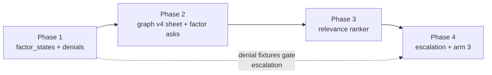
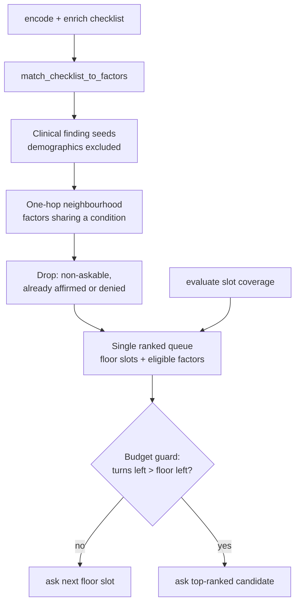

# Graph-driven intake (plan, 1 Sep 2026 · revised 10 Sep 2026)

Pickup note for making DigiMSK order its intake questions by **graph relevance**, while keeping the existing HPI **slot floor** as a completion requirement. Written from the 31 Aug–1 Sep 2026 design discussion. Not implemented.

**Revision, 10 Sep 2026.** The earlier draft built a second coverage layer that enumerated every unknown factor on every touched high-acuity condition and *interrupted* the HPI until those clusters were complete. That is the wrong behaviour — it drives toward covering the whole graph. It is replaced here by a **single dynamically-ranked question queue**: the floor stays mandatory, graph factors join the same queue, and relevance decides the order each turn.

Related: current bot question/disposition behaviour vs literature is summarised at the end. Patient-agent freeze work remains in `patient_agent/STATUS.md` and is independent of this plan (`must_elicit` is OSCE metadata; the live bot must not read it).

---

## How this is split

**This document is the design reference — the "why". It is not the implementation checklist.** The work is broken into four phases, each with its own file, its own verification criteria, and its own blocking user actions. Review and merge them one at a time, in order.

1. [Phase 1 — Factor state and denial-aware matching](01_factor_state_and_denials.md). Three-state factor memory, negation handling, denial-adversarial CI fixtures. No change to which questions get asked.
2. [Phase 2 — Graph ingest and factor-question plumbing](02_graph_v3_and_factor_asks.md). `CONFIRM_AGAINST` scoring exclusion, load the v4 factors CSV (`askable` / `intent` / `fallback` / `synonyms`), `asked_factor` plumbing. A factor ask becomes possible but is reachable only through a test hook.
3. [Phase 3 — Relevance ranker and relaxed slot order](03_relevance_ranker.md). The behaviour change: one ranked queue, one-hop eligibility, tiers, coherence guard, floor budget guard.
4. [Phase 4 — Escalation, arm 3 views, and evaluation](04_escalation_arm3_and_eval.md). Red-flag hard escalation gated on affirmed polarity, the intake planner slice, session persistence.



The ordering is load-bearing, not stylistic. **Denial handling ships before anything can escalate.** Phase 3 makes red-flag vocabulary common in conversation and Phase 4 turns affirmed red flags into ED referrals; shipping either before Phase 1 makes the bot less safe than it is today.

---

## Goal

The bot should notice that a volunteered finding (e.g. neurologic symptoms) makes a **graph-adjacent** factor worth probing, and ask that grounded follow-up when it is the most relevant next question — even if the item is not in `REQUIRED_SYMPTOM_SLOTS`.

The floor stays the **minimum** interview. The graph decides the **order**, not whether the floor exists.

---

## Why the current path cannot do this

The bottleneck is routing and a hard-coded order, not "too few tools."

- LangGraph (`bot/app/orchestrator/graph.py`): encode → enrich → coverage → `plan_question` → **question** | **disposition** | **escalate**.
- `plan_next_question` (`question_planner.py`) only consults slot coverage + `max_questions` + `risk_hits`. The next slot is a **fixed sequence** (`intake_slots.py`): age → sex → symptom_anchor → quality → severity → duration → provocative → palliative → comorbidities. Nothing about the patient changes that order.
- `DIGIMSK_DISPOSITION_MODE=agentic` runs **after** coverage is complete (or the question cap). Its only legal finish is a patient-facing triage paragraph (`final_answer`). Tools are read-only over already-matched factors/paths/RAG.
- Extra graph tools on that loop cannot introduce a CES question mid-history.

CES is already in the graph: **Bilat neuro motor deficit**, **Bilat neuro sensory deficit**, **Bladder dysfunction**, **Bowel dysfunction**, **Saddle anaesthesia**. "Legs tingling" can match **Neuro sensory deficit**. CES's distinctive factors stay unknown unless volunteered. Today the planner still asks quality → severity → duration → worse → better regardless.

Hard escalate (`policy.py`) is still only suicide/self-harm, chest pain, respiratory distress — not LBP red flags.

`must_elicit` is Hidden freeze metadata. The live bot never sees it. Graph-ranked questions are how CES gets asked when the card did not list it.

---

## Design: one planner, one ranked queue

Keep LangGraph. Do **not** replace intake with a free-form LLM clinician. There is no second coverage layer and no interrupt — there is one candidate list, re-ranked every turn.



### The floor (unchanged as a requirement)

Age, sex, comorbidities, symptom_anchor, quality, severity, duration, provocative, palliative.

`ready_for_disposition` still requires all of them. The model does not skip the floor because it "already knows enough." What changes is that the floor is no longer asked in a fixed sequence.

### Eligibility: one hop from a clinical finding

A factor `G` is a candidate this turn only if all of these hold:

- `G` shares a condition with at least one currently matched factor. `factors_by_condition` in `agentic_graph_rag/ontology.py` already folds `CONFIRM_AGAINST` rows into membership, so the tingling → CES hop needs no extra planner logic.
- `G` is askable (see filter below).
- `factor_states[G] == "unknown"`.

**Seeds are clinical findings only.** `Age over 50`, `Male sex`, and `Female sex` are excluded as neighbourhood seeds. `Age over 50` alone belongs to all six non-mechanical conditions (`r_1`, `r_20`, `r_34`, `r_50`, `r_65`), so seeding from demographics makes one hop cover essentially the whole graph — the exact behaviour this revision removes. They still count as matched factors for disposition; they just do not open new question territory.

No relevance threshold and no completion goal. When the neighbourhood is exhausted or the budget runs out, disposition proceeds.

High-acuity set = **CES, AAA, DVT, Infection, Fracture, Malignancy** — every condition in the graph except **Non-specific Mechanical Cause**. DVT is included: untreated it embolises, and its distinctive factors (`Calf pain`, `Calf swelling`, `Calf redness`, laterality) are cheap to ask and not otherwise covered by the floor.

#### Prerequisite: `CONFIRM_AGAINST` edges in graph v3

In v2 this feature could not work at all. CES was only *touched* when one of its own factors already matched. "Legs tingling" matches `Neuro sensory deficit`, which sat only on Fracture, Malignancy, and Infection, with no edge linking it to the CES cluster.

**v3 fixes this in the knowledge graph.** A `CONFIRM_AGAINST` relationship connects a non-specific finding to the condition whose distinctive factors need clarifying, e.g. `red_flags_manual_v3_2026.9.9.csv` `r_42`:

```
parent_id=CES, source_nodes=Neuro sensory deficit,
edges=CONFIRM_AGAINST, path_type=direct, path=-
```

Because `ontology.py` builds `factors_by_condition` from `parent_id` + `source_nodes`, this row alone makes `Neuro sensory deficit` a CES factor. Tingling now reaches CES's remainder through ordinary membership.

No code-side factor-family table is needed. The hop lives in the graph, is versioned with it, and is clinically reviewable in the same CSV as everything else.

**`CONFIRM_AGAINST` must be excluded from risk scoring.** The edge means "ask about this," not "this raises suspicion." `condition_ranker` / `inference` score path segments, so if these edges feed the scorer, ordinary unilateral tingling will start ranking CES in the disposition and in the arm 2 / arm 3 narrative. Filter the relationship type out of `score()` inputs while keeping it in traversal and coverage. This is the one non-obvious code change the v3 edges require.

**Escalation must ignore it too.** A `CONFIRM_AGAINST` touch is a reason to ask, never a reason to escalate. Only affirmed `SUGGESTIVE_OF` / `TRIGGER_FOR` factors reach the policy gate.

#### Askable-factor filter

Not every ontology factor is a question. `Endothelial injury`, `Hypercoagulability`, `Venous stasis`, `Nutrient Deficiency`, `Vitamin Deficiency`, `Mechanical loading` are mechanisms / mediators. **v4 adds a factors CSV** (`red_flags_factors_v4_2026.9.10.csv`, beside the edges file): one row per unique Factor name, with `askable`, `intent`, `fallback`, and `synonyms`. The planner reads `askable` from that file — not from a code-side allow-list and not from extra columns on the edge CSV.

`Hypercoagulability`, `Venous stasis`, and `Endothelial injury` are each **both** a direct DVT factor and a mediator on other rows, so the flag must be per **node**. That is why it lives on the factors CSV, not on every edge row. `askable=no` only forbids asking; the factor can still match for disposition.

When a non-askable mediator is the top candidate, ask the askable factors that feed it — derivable from the existing mediated rows, no LLM inference required (`Recent surgery` → `Endothelial injury`; `Prolonged bed rest` → `Venous stasis`; `Diabetes` / `Hypertension` → `Hypercoagulability`).

### Ranking: deterministic tiers, existing data only

Proposed default order, tunable:

- **Tier 0:** `symptom_anchor` if missing
- **Tier 1:** time-critical factors (CES, AAA, DVT)
- **Tier 2:** `age`, `sex`, `comorbidities`
- **Tier 3:** other high-acuity factors (Fracture, Malignancy, Infection)
- **Tier 4:** remaining symptom slots (see relaxed order below)
- **Tier 5:** Non-specific Mechanical Cause factors

Within a tier, break ties by: `is_specific` yes before no, then factor sits on ≥2 currently touched conditions, then count of matched factors already on that condition, then ontology order.

`is_specific` is already a per-row column parsed in `bot/app/services/graphrag/csv_rows.py`, but `RedFlagOntology` does not expose it per factor yet. Small ontology extension.

**Why `comorbidities` sits in Tier 2 rather than last.** Unlike `age` and `sex`, the comorbidity answer is itself a rich source of graph seeds: `Diabetes`, `Osteoporosis`, `Previous cancer`, `Immunosuppression`, `Rheumatoid arthritis`, `Hypertension`, `Cardiovascular disease`, and `Previous DVT` are all comorbidity-shaped factors, and each touches only one to three conditions rather than all six. Asking it early opens genuinely discriminating neighbourhood rather than flooding it. This is the inverse of the demographic-seed exclusion: demographics are excluded as seeds because they touch everything, comorbidities are promoted because they do not.

Note the ordering consequence: `comorbidities` currently sits last in `select_next_missing_slot` (`intake_slots.py`), returned only once no symptom gaps remain. Tier 2 removes that precondition.

### Relaxing the fixed slot order

Today `_first_missing_for_symptom` in `intake_slots.py` walks `_SYMPTOM_SLOT_ORDER` (quality, severity, duration, provocative, palliative) as a hard sequence. That order is arbitrary with respect to what the graph needs. Replace it with prerequisites plus a relevance score, so slots compete in the same queue as factors.

**Hard prerequisites (the only ordering that survives):**

- `symptom_anchor` precedes every symptom-attribute slot. Nothing else is a real dependency.
- Per-symptom binding stays: with multiple symptom instances, a slot is still asked against a specific `symptom_id`.

**Slot relevance = how much graph the answer opens.** Slot answers already feed the factor matcher, and the yield is uneven and known statically from `_KIND_LABEL_FACTORS` and `_TEXT_ALIASES` in `factor_patterns.py`:

- `comorbidities`: `Diabetes`, `Osteoporosis`, `Previous cancer`, plus alias reach to `Immunosuppression`, `Corticosteroids`, `Rheumatoid arthritis`. Highest yield — the Tier 2 justification above.
- `symptom_quality`: `Night pain` and `Unexplained weight loss` (both Malignancy and Infection), plus `Constant pain` and `Fluctuating pain` by alias.
- `symptom_severity`: `Severe pain` via `_severity_implies_severe`, touching Fracture, Malignancy, Infection.
- `provocative`: `Pain weight-bearing` (Fracture), plus mechanical aliases.
- `palliative`: mechanical aliases only, plus the `("palliative", "rest") → Constant pain` mapping that `_gap_for_match` already flags as clinically inverted.
- `symptom_duration`: **no deterministic factor at all.** No duration factor exists in the inventory. Only the optional LLM cross-check could reach `Refractory pain` from a long non-improving duration.

So the default ordering inside Tier 4 becomes quality, severity, provocative, palliative, **duration last** — it opens no graph territory. It remains mandatory for the floor and for the disposition summary; it is simply never the most informative next question.

**Coherence guard (prevents topic thrash).** Pure per-turn re-ranking produces incoherent interviews (severity, then saddle, then duration, then calf pain, then quality). Two rules:

- **Same-topic continuation.** A candidate bound to the same `symptom_id` and topic as the previous turn gets a bonus, so a line of questioning finishes before the queue moves on.
- **Hysteresis.** Do not switch topic unless the new candidate outranks the incumbent by a full tier. Tier 1 time-critical factors ignore this and always pre-empt.

Record the winning rationale in `question_reason` (for example `rank:t1:CES:Saddle anaesthesia` versus `rank:t4:symptom_quality`) so a transcript shows why each question was chosen and in what order.

### Floor protection

The floor remains a hard requirement for `ready_for_disposition`. To stop factor questions starving it:

```
remaining_floor = count(missing floor slots)
if (max_questions - questions_asked) <= remaining_floor:
    ask floor slots only
```

**Budget.** Raise `max_questions` to 20. With a floor of roughly nine, that leaves about eleven discretionary turns.

If the budget is exhausted while a time-critical CES / AAA / DVT factor is still unknown: "not enough to advise" — **not** a mechanical self-care dump.

This is Ada-like relevance ranking **computed from the graph**, not from the model's opinion.

---

## Three-state factor store (required)

Slots today are only filled / missing. Graph questions need per-factor:

`unknown | affirmed | denied`

Without denials the bot will re-ask CES every turn or treat silence as "no CES."

**Where it lives: a new `factor_states: dict[str, str]` on `ChatState`, keyed by canonical Factor name.** Not a new field on `ChecklistItem` — `content_dedupe_key` is `(text, kind, source, label)`, so an affirmed and a denied row for the same finding collide, and a polarity field would ripple into `merge_checklist_items`, the enricher contract, coverage, and session JSON. A separate map is additive, is exactly what the ranker consumes, and serialises cleanly through the checkpointer.

"I'm not sure" stays `unknown`, not `denied`.

### The negation hazard this feature creates (read before implementing)

Factor matching today is **negation-blind**, and graph questions deliberately inject red-flag vocabulary that patients then echo back in denials.

- `_TEXT_ALIASES` maps the bare token `"bladder"` → `Bladder dysfunction` and `"bowel"` → `Bowel dysfunction`, word-bounded against raw checklist text.
- `credit_asked_slot_answer` writes the patient's reply into the checklist as a row.
- The fuzzy fallback in `factor_matcher.py` matches on token overlap ≥ 0.75, so "no bowel dysfunction" scores 1.0 against `Bowel dysfunction`.

Net effect: bot asks "any bladder problems?" → patient answers "no bladder problems" → `Bladder dysfunction` affirmed → hard escalate → **false ED referral generated by the question that was meant to protect the patient.**

DVT widens this surface. `Calf pain` / `Calf swelling` / `Calf redness` are short, common phrases with existing aliases (`"calf ache"`, `"leg swelling"`), and "no calf pain" clears the 0.75 fuzzy threshold against `Calf pain` outright. DVT questions are also the ones most likely to be asked of low-risk patients, so they generate the most denials per session.

Two hard requirements follow:

1. Denial-aware matching ships **before** any factor-driven escalation. It is not a parallel workstream.
2. Escalation keys off `factor_states[factor] == "affirmed"`, **never** off membership in `matched_factors`.

### Escalation rule (narrower than "high-acuity membership")

Do not hard-escalate on any single affirmed factor in those clusters. `Bladder dysfunction` alone in an older patient with chronic urinary symptoms is a routine false positive, and `prompts/clinical_reasoning_framework.md` is built on "clusters, not isolated findings."

Escalate on either:

- a named short list of genuinely standalone triggers (`Saddle anaesthesia`, new `Bilat neuro motor deficit` / `Bilat neuro sensory deficit`), **or**
- any other CES / AAA / DVT factor affirmed **together with** the spinal-pain anchor.

DVT makes the cluster rule especially important: `Calf pain` and `Calf swelling` are individually common and benign, and the graph itself says each "alone is not an indicator" (`r_60`–`r_62`). DVT escalates on a **combination** plus laterality, never on one calf symptom.

---

## CES walkthrough (what "autonomous" means)

Patient: "My back hurts and my legs have been tingling."

| Step | Who decides | Result |
|---|---|---|
| Encoder | code | symptom + **Neuro sensory deficit** (if patterns/GliNER fire) |
| Neighbourhood | code | `Neuro sensory deficit` is a clinical finding, so it seeds. One hop reaches Fracture / Malignancy / Infection factors **and CES's remainder via the v3 `CONFIRM_AGAINST` edge** (`r_42`) |
| Ranking | code | `Saddle anaesthesia` is Tier 1 (CES, time-critical) and `is_specific=yes`; it outranks the Tier 4 symptom slots this turn |
| Wording | LLM, bound to that factor | "Have you noticed numbness around the groin or saddle area?" |
| Next turn | encoder | yes → affirm → policy/ED; no → **`factor_states` = denied** (must not re-match as affirmed), and the queue re-ranks — usually back to Tier 4 |

The agent "figured it out" because the graph itself links neuro findings to CES via `CONFIRM_AGAINST`, and the ranker put that factor above the next slot. Everything — the hop and the remainder — comes from the versioned CSV.

The bot does **not** work through the CES battery. It asks the single highest-ranked question each turn; if the patient denies saddle anaesthesia, the remaining CES factors compete on relevance like everything else.

---

## Tools: add a few, do not open the floodgates

Current tools (`get_matched_factors`, `list_touched_conditions`, `get_factor_paths`, `get_condition_evidence`, `search_evidence`) only explain **what already matched**. They cannot say **what is worth asking next**.

Add **read-only, ontology-validated** tools:

| Tool | Returns | Why |
|---|---|---|
| `get_coverage_status` | missing floor slots + questions remaining | Floor stays visible to the agent |
| `get_neighbour_factors` | ranked eligible factors: one hop from a clinical-finding seed, askable, still `unknown` | The whole candidate list in one call |
| `get_discriminating_factors` | eligible factors on ≥2 currently touched conditions | Tie-break input within a tier |
| `get_factor_question_spec(factor)` | `askable` + `intent` + `fallback` + `synonyms` from the v4 factors CSV | Wording stays grounded |

`get_factor_question_spec` reads the v4 factors CSV, **not** `factor_patterns.py`. That file maps volunteered checklist text → factor name; it has aliases for roughly a third of the inventory and none for `Bilat neuro sensory deficit` / `Bilat neuro motor deficit`. There is no second authored table outside the graph pack.

**Do not** add `ask_patient(free_text)` or a write tool that mutates the graph.

Terminal JSON stays structured. New branches besides today's `final_answer`:

```json
{"thought": "...", "action": "ask_factor", "action_input": {"factor": "Saddle anaesthesia"}}
```

```json
{"thought": "...", "action": "ask_slot", "action_input": {"slot": "symptom_duration"}}
```

`final_answer` only when `get_coverage_status` says the floor is met **and** `get_neighbour_factors` is empty (or the budget is exhausted — then insufficient-info wording).

Code must reject `ask_factor` if the name is not in `ontology.factor_set()`, not askable, already known, or not eligible this turn. Same pattern as today's "LLM draft only counts if it matches the chosen slot."

---

## How much of the planner should be an LLM?

Two viable builds, in order of safety:

**1. Code-first (ship first).**
`select_next_missing_slot` is replaced by a ranker that takes both remaining floor slots and eligible factors and returns the single top candidate. LLM only phrases. Fast, testable, matches "code steers, model writes." The CES example does not need a model to "realize" it.

**Insertion point matters.** `plan_next_question` returns early, in order, on `risk_hits`, then `questions_asked >= settings.max_questions`, then `coverage.ready_for_disposition` (`question_planner.py`, ~lines 43–52). `select_next_missing_slot` is only reached *after* all three. So:

- The ranker must run **before** the `ready_for_disposition` return, or a complete-coverage case never gets a graph question and the "floor met **and** no eligible factors" rule silently never fires.
- The `max_questions` branch must consult eligible factors before returning `max_questions_reached`.

**2. Constrained intake agent (second).**
Reuse the ReAct loop **during** `plan_question`, not only at disposition. Same tools, new allowed terminals (`ask_slot` / `ask_factor` / `ready`). Cap steps (2–4). If parse fails, fall back to (1).

Do not start with (2) alone. Without (1) as fallback, one bad JSON turn skips CES or skips age.

The unused `score_conditions_bayesian` hook is a later refinement (true information gain). Tiered adjacency ranking is enough for CES-after-tingling.

---

## What not to do

- Do **not** attempt to complete every touched cluster. The queue **reorders**; it does not enumerate. There is no "graph coverage" completion state.
- Do **not** only expand `REQUIRED_SYMPTOM_SLOTS` with a static CES list (asks saddle of every mechanical sprain).
- Do **not** seed the neighbourhood from demographics — one hop from `Age over 50` is the whole graph.
- Do **not** let the current disposition agent emit a question by stuffing it into `final_answer` (routing would treat it as advice; `slot_being_asked` is lost).
- Do **not** have the bot read `must_elicit`.
- Do **not** replace LangGraph with an unorchestrated conversational doctor (AMIE-style). Allowed next acts stay graph-legal, not free text.
- Do **not** force a clinical disposition at `max_questions` if a time-critical CES / AAA / DVT factor is still unknown.
- Do **not** drop `symptom_duration` because it ranks last. Last is not optional.
- Do **not** add relationships to the knowledge graph *for visualization*. New edge types are a clinical-content decision (like v3's `CONFIRM_AGAINST`), reviewed in the edge sheet and versioned with the graph. Arm 3 draws a **slice of whatever the graph already contains** and invents nothing.
- Do **not** create a Python question-spec table or extra `askable` columns on the edge CSV. Node properties (`askable`, `intent`, `fallback`, `synonyms`) live on the v4 factors CSV.

---

## Arm 3: two graph views (planner slice + existing disposition subgraph)

Study arm 3 already renders `graph_traversal` as Cytoscape (nodes, edges, highlights, step list). Today that payload is built only at **disposition**. Question turns clear it (`generate_question_node`), so the panel never shows *why this question*.

Ship **both** views. Decide later whether the UI keeps one, the other, or both.

### View A — existing disposition subgraph (keep)

Unchanged: matched factors → real CSV/Neo4j paths → conditions, plus the current highlight/step list. This is "why this advice." Built by `graph_traversal_node` / agentic provenance, same `GraphTraversalTrace` shape as today.

### View B — intake planner slice (new)

Same payload shape (`GraphTraversalTrace` or a compatible subset), different *slice* and `mode` (e.g. `intake_gap` vs today's `traversal`). This is "why this question." Built after ranking on **question** turns, and accumulated across the interview.

**Schema literals must be widened in two hand-mirrored files.** `mode` is `Literal["traversal"]` in `bot/app/services/graphrag/schemas.py` *and* in the duplicated study-app copy `prototypes/digimsk_study_app/digimsk_study_app/graph/schemas.py`. `TraversalAction` is likewise a closed literal in both. Adding `intake_gap` plus new step actions (`graph_gap`, `ask_factor`, `deny_factor`) without editing both will fail Pydantic validation in the study app. Note `scripts/sync_digimsk_cytoscape.py` syncs the Cytoscape JS but **not** these schemas — the mirror is manual.

What to draw — **only existing graph edges**:

- Affirmed factors: filled, as today.
- Denied factors: same Factor nodes, dimmed (session state, not a graph edit).
- Current ask target: dashed / highlighted (e.g. `Saddle anaesthesia`).
- Edges: the real `RISK_FACTOR_FOR` / `SUGGESTIVE_OF` / `CONTRIBUTES_TO` links those nodes already have to their conditions.

CES-after-tingling: matched `Neuro sensory deficit` with its real `SUGGESTIVE_OF` edges to Fracture / Malignancy / Infection **and its real v3 `CONFIRM_AGAINST` edge to CES**; CES's remainder factors attached to CES; current ask highlighted. Draw `CONFIRM_AGAINST` in a visually distinct style so a "we are asking about this" edge never reads as "this points to CES." Invent no edges beyond what the CSV contains; the step list carries the ranking rationale (`question_reason` like `rank:t1:CES:Saddle anaesthesia`).

Ranking reuses `match_checklist_to_factors` / `tally_touched_conditions`. It does not re-match text. The new work is the neighbourhood, the tiers, and this slice.

### Both in the same response / session

**Use a separate `intake_traversal` field — do not reuse `graph_traversal`.** The clear in `generate_question_node` is deliberate: it stops a previous turn's disposition subgraph from being re-served alongside a later question. Since we want both views live, a second field is cleaner than one contested slot.

- Add `intake_traversal: NotRequired[dict | None]` to `ChatState` and to `ChatResponse`.
- Keep the existing `graph_traversal` clear on question turns exactly as it is.
- Write View B to `intake_traversal` on every question turn; View A keeps writing `graph_traversal` at disposition / escalate.
- Arm 3 can then show either or both with no overwrite risk, which is the whole point of shipping two views.

**Persistence gap.** `build_disposition_record` returns `None` whenever `question_mode` is true, so nothing from a question turn reaches `disposition_history`. `build_orchestrator_snapshot` logs `question_reason` and `slot_being_asked` but carries no graph payload. The accumulating `intake_steps[]` (match → rank → ask → affirm/deny) needs a concrete home: extend `build_orchestrator_snapshot`, or add a sibling `intake_history` record. Also add `factor_states` to the session snapshot so denials survive a reload.

- Study app: same Cytoscape path; `mode` plus two keyed payloads (`intake` + `disposition`) lets the client show planner slice, disposition subgraph, or both. Product choice deferred.

---

## Implementation

Moved out of this document. See the four phase plans linked under [How this is split](#how-this-is-split); each carries its own file-level change list, verification criteria, risks, and blocking user actions.

The success criteria below are the **end-state** measures for the feature as a whole. Per-phase verification lives in the phase files, and most of these cannot be measured until Phase 3 has landed.

---

## How to know it worked

**This requires a re-run, not a re-read.** The frozen transcripts were produced by the current bot, so a new CES question cannot appear in them. Re-run the patient agent against the modified bot using the same locked cards, then compare old vs new transcripts per case.

Sensitivity (does it fire when it should):

- If the actor discloses neurologic symptoms and Hidden does **not** list CES in `must_elicit`, the new transcript should contain a graph-grounded CES item (`question_reason` like `rank:t1:CES:Saddle anaesthesia`).

Specificity (does it stay quiet when it should):

- If they never mention neuro, no CES question should appear — only the floor.
- Report the **distribution of graph questions per session**, not just a mean. A long tail means the neighbourhood is too permissive; check whether demographics leaked in as seeds.

Safety (the metric this feature actually needs):

- Add a **denial-adversarial fixture set** where the actor denies every red flag using the bot's own vocabulary ("no bladder problems", "no numbness in the saddle area", "no bowel dysfunction").
- Assert **zero escalations** and **zero affirmed factors** across that set. This is the regression test for the negation hazard above and should run in CI, not once by hand.

Floor integrity:

- No case may finish with the floor incomplete because graph questions consumed the budget. Track floor-completion rate before vs after.
- Confirm `symptom_duration` moves later in the transcript without ever being dropped.

Coherence:

- Count topic switches per session before and after. The relaxed order should not read as a more scattered interview; if switches rise sharply, the hysteresis rule is too weak.

Arm 3:

- A factor turn includes a planner slice (View B, on `intake_traversal`) whose highlighted factor matches `question_reason`; a later disposition turn still includes the matched-path subgraph (View A, on `graph_traversal`). No new relationship types beyond what the CSV defines.

---

## Appendix — current engine vs literature (31 Aug 2026)

DigiMSK today: **local code decides the clinical next step; a language model only writes the sentence.** Coverage is slot completeness, not "have we ruled out serious disease." GraphRAG / agentic GraphRAG run at **disposition**, not during questioning.

| Approach | Who asks what | How advice is produced | Vs DigiMSK |
|---|---|---|---|
| Commercial symptom checkers (Ada, Babylon, Buoy) | Adaptive: next question maximises information about a disease set | Ranked conditions + triage | This plan moves DigiMSK into the same family, but ranks by graph adjacency and acuity rather than probabilistic information gain |
| Guideline / NHS-111 style (NICE NG59) | Red flags early, then mechanical vs radicular | Pathway node → disposition | Graph is NICE-like **at the end**; this plan brings it into intake |
| LLM clinicians (AMIE, AgentClinic) | Model improvises history-taking | Open-ended diagnosis | DigiMSK is the inverse: auditable ranking, stiffer talk |
| GraphRAG / tool-using medical agents | Often the LLM chooses tools *and* questions | Graph + retrieval + LLM | Disposition path is in this family; question path stays code-ranked |
| Ungrounded GPT wrappers | Model decides everything | Model decides everything | DigiMSK stronger on safety *design* |

This plan keeps that safety design and moves graph inspection **into question planning**, with the floor as a completion requirement rather than a fixed script.

---

## Actions required by the user (offline, before implementation)

Knowledge-base and clinical-judgement items. None of these are code changes; all of them block or distort the ranker if left as-is. Each is tagged with the phase it gates, so nothing has to be finished before Phase 1 starts except action 7.

- **Phase 1:** action 7 (denial phrasebook)
- **Phase 2:** ~~action 3, then v4 pack export~~ **done 10 Sep 2026** (v3 pack earlier; 5 absorbed into 3)
- **Phase 3:** action 9
- **Phase 4:** actions 6, 10
- Already decided: actions 2 and 8

### Knowledge base — gates [Phase 2](02_graph_v3_and_factor_asks.md)

1. ~~**Finish the `CONFIRM_AGAINST` edge set.**~~ **Done 10 Sep 2026.** Five edges: `Neuro sensory deficit` / `Neuro motor deficit` → CES (`r_45`, `r_46`); `Recent surgery` / `Refractory pain` / `Point tenderness` → Infection (`r_30`–`r_32`). `Severe pain` → AAA was a candidate and was not added.
2. ~~Classify DVT.~~ **Decided 9 Sep 2026: DVT is high-acuity.** All six non-mechanical conditions rank above Non-specific Mechanical Cause. No further action.
3. ~~**Author the v4 factor sheet.**~~ **Done 10 Sep 2026.** `red_flags_factors_v4_2026.9.10.csv` sits beside `red_flags_edges_v4_2026.9.10.csv`. One row per unique Factor name; columns `askable`, `intent`, `fallback`, `synonyms`. `askable=no`: `Endothelial injury`, `Hypercoagulability`, `Venous stasis`, `Nutrient Deficiency`, `Vitamin Deficiency`, `Mechanical loading`, `Osteoporosis`, `Age over 50`, `Male sex`, `Female sex`. CES cluster first. Not extra edge columns, not `factor_patterns.py`.
4. ~~**Re-export the backup pack.**~~ **Done.** v3 pack earlier; **v4** promoted 10 Sep 2026 (`Graphs/backups/red flags/v4/` is a local snapshot). `bot/.env` points at the Knowledge Base CSVs + inventory. Aura wiped and reloaded from the edges CSV.

### Clinical content to author

5. ~~**Question specs as a separate file.**~~ **Absorbed into action 3.** `intent` / `fallback` / `synonyms` live on the v4 factor sheet. Priority fill: `Bilat neuro sensory deficit`, `Bilat neuro motor deficit`, `Saddle anaesthesia`, `Bladder dysfunction`, `Bowel dysfunction`.
6. *(gates [Phase 4](04_escalation_arm3_and_eval.md))* **Standalone escalation list.** Which affirmed factors justify immediate ED referral on their own, versus which require the spinal-pain anchor or a second factor. Current suggestion: `Saddle anaesthesia` and new bilateral deficits stand alone; `Bladder dysfunction` / `Bowel dysfunction` do not.
7. *(gates [Phase 1](01_factor_state_and_denials.md) — the only item blocking the first phase)* **Denial phrasebook.** Representative patient denial wordings per CES / AAA / DVT factor, to seed the adversarial fixture set and the negation patterns.

### Product / study decisions

8. ~~Question budget.~~ **Decided: `max_questions` = 20**, single shared budget, with the floor-protection guard above. No separate graph budget.
9. *(gates [Phase 3](03_relevance_ranker.md))* **Confirm the ranking tiers.** The Tier 0–5 table is a clinical judgement call, not a derivation. Confirm or amend — especially Tier 2 (`age`, `sex`, `comorbidities` above Fracture/Malignancy/Infection factors) and duration ranking last inside Tier 4.
10. *(gates [Phase 4](04_escalation_arm3_and_eval.md) UI work only)* **Arm 3 presentation.** Whether the study UI shows View A only, View B only, or both — and whether View B appears mid-interview or only in the post-hoc record. Both payloads will be produced regardless; this is a display choice.
